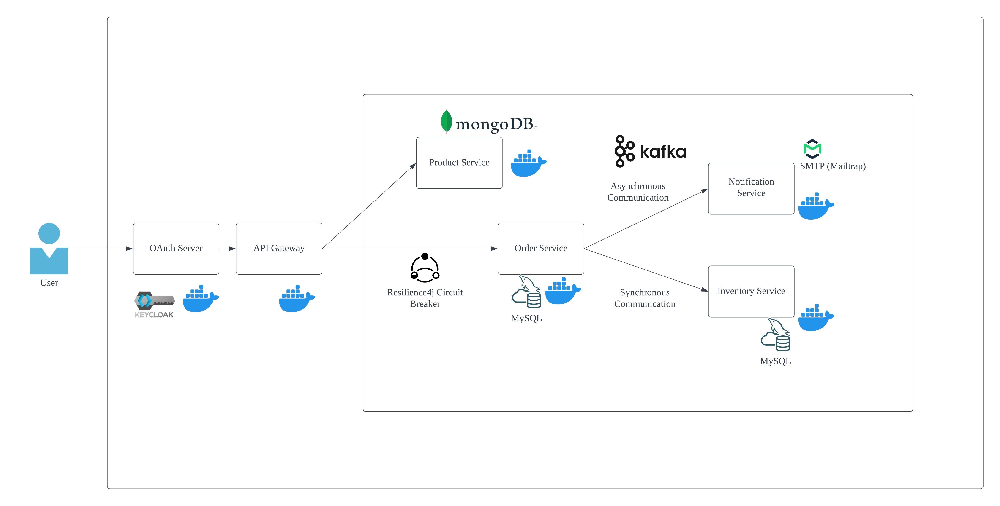

# Backend Spring Boot Microservices
This project is utilizes Spring Boot 3 for microservices and integrated technologies such as MongoDB, MySQL, Kafka and Keycloak. This application features a product catalog service, order processing, inventory management and a notification system, all orchestrated through a Spring Cloud Gateway API. 

## Services Overview
- Product Service
- Order Service
- Inventory Service
- Notification Service
- API Gateway using Spring Cloud Gateway MVC

## Technology Stack
Technologies used in the project consist of:
- Spring Boot
- Mongo DB
- MySQL
- Kafka
- Keycloak
- Test Containers with Wiremock
- API Gateway using Spring Cloud Gateway MVC

## System Architecture
